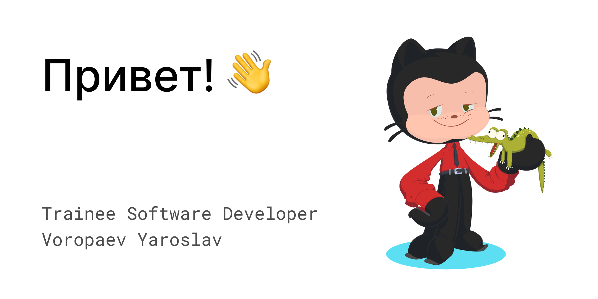

### I'm an aspiring developer looking to master various programming languages and create a project in each. Welcome to my code corner, where I document my progress, share experiences, and track achievements!

### GPG: [1764f2d4e6187b05068d8abc95c668b838b80d74](https://keyoxide.org/1764f2d4e6187b05068d8abc95c668b838b80d74)

# Skills
### Languages

### Web

### Other

### Additionals

# Stats

    
    

# A little bit more...
### I playing chess

### I blogging

### I programming

### I making games

# Contacts

You can follow me, my achievements, projects, and learning progress on my profile <3

Feel free to reach out to discuss ideas, suggestions, or just exchange experiences :)

### Thanks for visiting! Let's make code better again together 🚀
